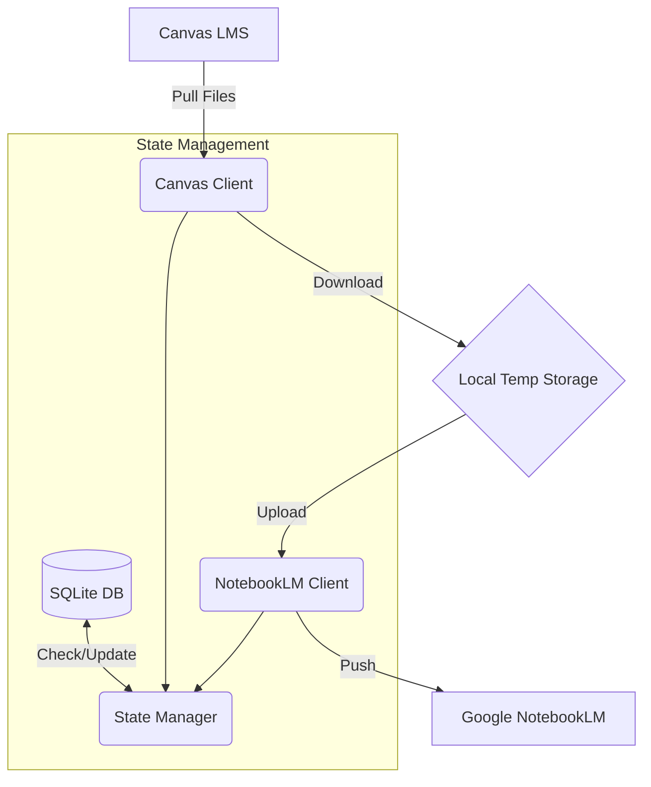

# Technical Design Document 🛠️

## Architecture Overview
The system follows a typical ETL (Extract, Transform, Load) pattern, tailored for Canvas and NotebookLM.

## Components

### Canvas Connector (`canvas_client.py`)
- **Library**: `canvasapi`
- **Role**: Handles all communication with the Instructure Canvas API.
- **Key Responsibilities**:
    - resolving generic "Course" objects.
    - recursively traversing folder structures to find files.
    - handling file downloads with proper authorization headers.

### State Manager (`state_manager.py`)
- **Storage**: `sqlite3`
- **Role**: Prevents duplicate work and tracks the mapping between Canvas Courses and NotebookLM Notebooks.
- **Key Responsibilities**:
    - `get_course_notebook_id(course_id)`: Returns the NotebookLM ID if we already created one for this course.
    - `is_file_processed(file_id)`: Returns `True` if specific file version has already been uploaded.
    - `get_all_managed_courses()`: Retrieves list of courses currently tracked.
    - `delete_course(course_id)`: Removes course and files from DB (supporting the "Delete" feature).

### NotebookLM Integrator (`notebook_client.py`)
- **Library**: `notebooklm-py`
- **Role**: Interacts with the unofficial NotebookLM interface.
- **Key Responsibilities**:
    - Creating new notebooks.
    - Uploading source files.
    - **Wait Logic**: Uses `wait_for_sources(ids=...)` to ensure processing completes before moving on.
    - **Logging**: Captures detailed logs for debugging.

## Data Flow
### Sync Flow
1.  **Init**: Load auth keys, setup logging.
2.  **Selection**: 
    - *Interactive*: User selects "Sync All" or "Managed Only".
    - *Headless*: args determine scope.
3.  **Map**: For each course:
    - `state_manager` checks if Notebook exists.
    - If not, prompt user (unless `-y`), then `notebook_client` creates one.
4.  **Process**:
    - Iterate through files.
    - Check `state_manager` if file ID is "done".
    - If new:
        - Download -> Upload -> Mark Done.

### Delete Flow
1.  User selects "Delete" from menu.
2.  `state_manager` lists all courses.
3.  User enters indices.
4.  `state_manager` removes records from `files` and `courses` tables.

## Database Schema
The SQLite database (`state.db`) is simple:

### `courses` Table
| Column | Type | Description |
|or|---|---|
| `course_id` | TEXT (PK) | Canvas Course ID |
| `course_name` | TEXT | Human readable name |
| `notebook_lm_id` | TEXT | The UUID from NotebookLM |
| `last_synced_at` | TIMESTAMP | Last run time |

### `files` Table
| Column | Type | Description |
|---|---|---|
| `file_id` | TEXT (PK) | Canvas File ID |
| `course_id` | TEXT (FK) | Maps to `courses` |
| `file_name` | TEXT | Original filename |
| `upload_status` | TEXT | 'uploaded' or 'pending' |
| `last_updated_at` | TIMESTAMP | When it was synced |

## Future Improvements
- **Headless Auth**: Improve the login flow to be fully headless if possible (currently often requires one interactive login).
- **Format Conversion**: Auto-convert HTML pages (Canvas Pages) to PDF for upload, not just files.
- **Quiz Support**: Scrape quizzes and upload them as study guides.
